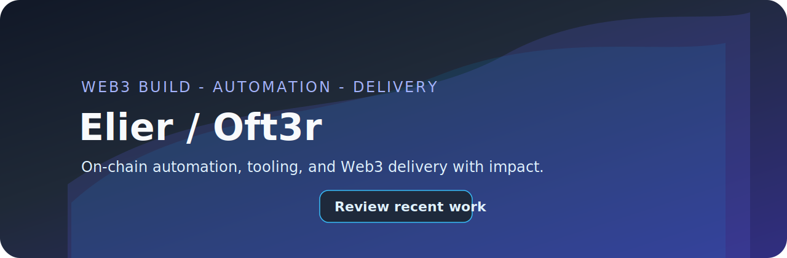
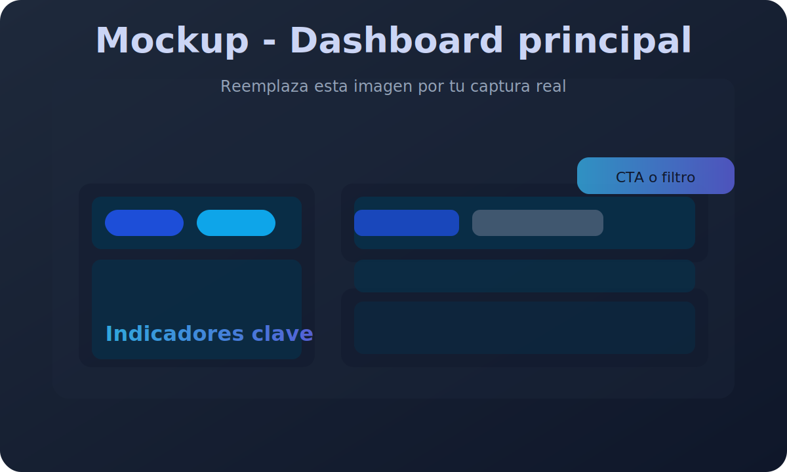
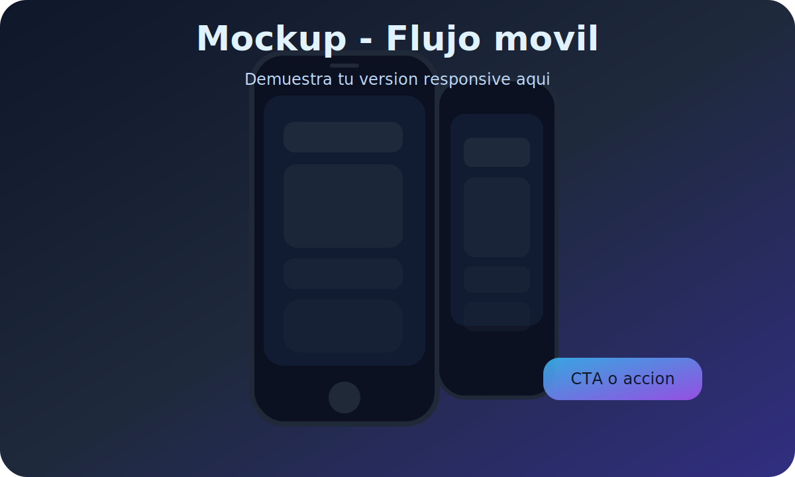
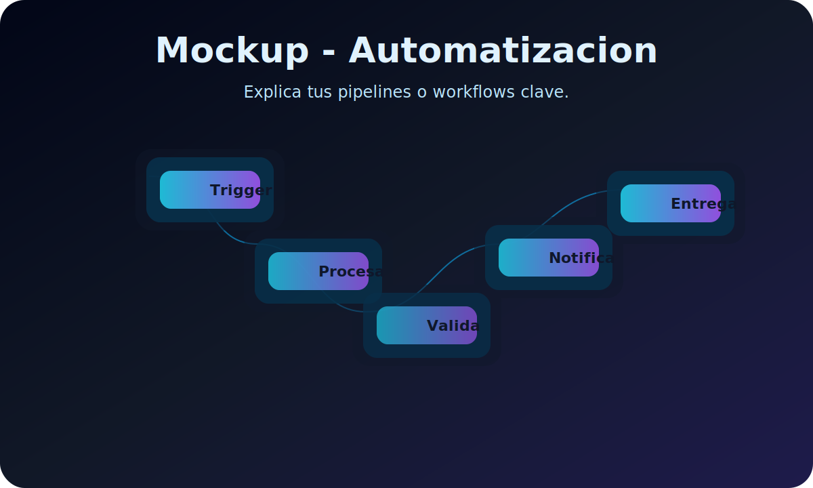

<!--
  README built to position Elier (Oft3r) as a Web3 security auditor and builder.
  Update metrics, contact links, and visual assets with your production information before publishing.
-->

  

<h1 align="center">Elier / Oft3r - Smart Contract Auditor and Web3 Builder</h1>

  
  
  
  

> Self-taught developer focused on smart contract safety, automation, and clean Web3 user experiences.

---

  
<strong>Interactive tour</strong>

  <ol>
    <li><a href="#value">Why teams choose me</a></li>
    <li><a href="#impact">Impact signals</a></li>
    <li><a href="#metrics">Live metrics</a></li>
    <li><a href="#highlights">Auto highlights</a></li>
    <li><a href="#visuals">Visual snapshots</a></li>
    <li><a href="#services">Services and engagement</a></li>
    <li><a href="#audit">Audit workflow</a></li>
    <li><a href="#toolkit">Toolkit</a></li>
    <li><a href="#roadmap">2025 roadmap</a></li>
    <li><a href="#collab">Collaboration playbook</a></li>
    <li><a href="#faq">FAQ</a></li>
    <li><a href="#contact">Contact</a></li>
  </ol>

## Why teams choose me

  <table>
    <tr>
      <td><strong>Web3 security</strong> Audits focused on real threat models and reproducible fixes.</td>
      <td><strong>Data and AI</strong> Automation for monitoring channels, chains, and contracts.</td>
      <td><strong>Agile delivery</strong> CI/CD guardrails and custom linters to shrink risk.</td>
      <td><strong>Product craft</strong> From native wallets to ChatOps interfaces for local models.</td>
    </tr>
  </table>

---

## Impact signals

- Smart contract audits: add the number of reviews, TVL secured, and client types (DAOs, L1s, startups).
- Critical findings: surface notable vulnerabilities discovered or proprietary analyzers you rely on.
- Automation in production: share the bots and monitors that reduced manual time or enabled alerts.
- Community presence: five public followers since 2021; add talks, newsletters, or mentoring if relevant.

---

## Live metrics

  
  &nbsp;&nbsp;
  

  

  

---

## Auto highlights

  

  
  &nbsp;&nbsp;
  

> Explore all public work directly on the [repositories tab](https://github.com/Oft3r?tab=repositories); the cards above update automatically.

---

## Visual snapshots

| View | Short description |
| ---- | ----------------- |
|  | Central dashboard highlighting metrics or risk posture. |
|  | Mobile wallet mockup to replace with production screenshots. |
|  | Automation workflow for reports, alerts, or CI/CD pipelines. |

`
assets/
??? hero-banner.svg
??? preview-dashboard.svg
??? preview-mobile.svg
??? preview-automation.svg
`

---

## Services and engagement

1. Smart contract audits (Xian, EVM, WASM) with reproducible findings, retesting, and optional certification.
2. Web3 development sprints covering wallets, dashboards, and AI powered monitoring surfaces.
3. Internal tooling: linters, automation, and bots that block regressions before deployment.
4. Technical mentoring for teams entering Web3, design patterns, and production readiness.

---

## Audit workflow

`mermaid
flowchart LR
  Discovery[1. Discovery] --> ThreatModeling[2. Threat Modeling]
  ThreatModeling --> StaticReview[3. Static and Symbolic Review]
  StaticReview --> DynamicTesting[4. Dynamic Testing]
  DynamicTesting --> Reporting[5. Report and Fix Plan]
  Reporting --> Retest[6. Retest and Certificates]
  Retest --> ContinuousWatch[7. Continuous Monitoring]
`

- Define scope: protocols, contracts, dependencies, and supporting documentation.
- Model realistic threats, prioritize invariants, and simulate adversarial paths.
- Automate unit tests and fuzzing, then score findings by severity and impact.
- Deliver a concise report, fix checklist, and follow through until retest sign off.

---

## Toolkit

  
  
  
  
  
  
  

> Add badges for frameworks such as Foundry, Hardhat, Dagger, or Supabase when they become part of your core stack.

---

## 2025 roadmap

- [x] Launch MVP of the Xian contract linter (VS Code extension).
- [x] Ship the Xian native wallet with secure key management.
- [ ] Publish an audit playbook with real findings and metrics.
- [ ] Release automation toolkits for contract monitoring.
- [ ] Host a workshop on Web3 security and applied AI.

  
<strong>Recent changelog</strong>

  - 2025-05 - Refined Ollama-Chat UX with multi model support.
  - 2025-04 - Open alpha for the Xian contract linter extension.
  - 2025-01 - Published abductchain as an educational lab.

---

## Collaboration playbook

`ash
# Reuse this workflow when collaborating
fork https://github.com/Oft3r/Ollama-Chat.git
cd Ollama-Chat
# Create a branch with a descriptive prefix
git checkout -b feature/ui-improvement
# Align style and tests
npm install && npm run lint && npm run test
`

1. Open issues with stack details, logs, screenshots, and an initial proposal.
2. Use PR templates with checklists, screenshots, and risk analysis.
3. Need an external security review? Reach out via issues or email to align on scope.
4. Planning to fork tools or extensions? Sync on the roadmap before large-scale ports.

---

## FAQ

**What support do you provide after an audit?**  
Retesting is included; specify your own SLA if additional coverage is required.

**Do you handle chains beyond Xian and EVM?**  
Yes. List other ecosystems here (Bitcoin L2, Cosmos, Move, etc.) that you actively cover.

**How do you manage credentials and secrets?**  
Document your policy (Vault, secret scanning, rotation cadence) and the observability stack.

---

## Contact

- Reach out via [GitHub issues](https://github.com/Oft3r/Oft3r/issues) or replace with a preferred mailto link.
- Add LinkedIn, Calendly, Discord, or any channel you monitor consistently.
- For long term support, enable [GitHub Sponsors](https://github.com/sponsors/Oft3r) or list additional options on your portfolio.

  Last updated <!-- update manually --> - Keep the story alive with regular commits.

